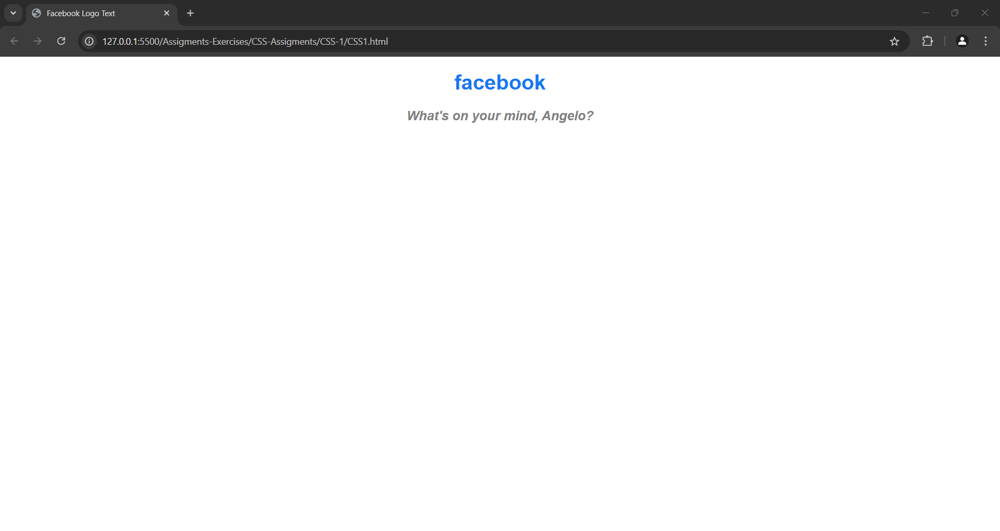

## CSS Assignment 1

Let's practice some of the text styling techniques we learned to recreate the "facebook" text logo and style the default post question. Given  the `CSS1.html` file with an `h1` tag for the facebook logo, edit the `CSS1.css` file and change the color to the hex code `#1877F2` and center it. 

Try to also style the `p` tag by setting the values of properties like font-size, font-style (italic), font-weight (bold), color (grey), and also center it. Lastly, feel free to place your name in the `CSS1.html` p tag to identify yourself!

### Self-Check
You can use these pointers to check your work, but it's not necessary to adapt all of them but only get relative close to the possible output.

- h1 color has a value of `#1877F2`.
- `text-align` property is used to center both h1 and p tags.
- Used "sans-serif" as `font-family` value for both tags.
- Used a any class name ("fb-text-style" for example) to apply similar rules on both tags.
- The p tag has about `20px` of value.