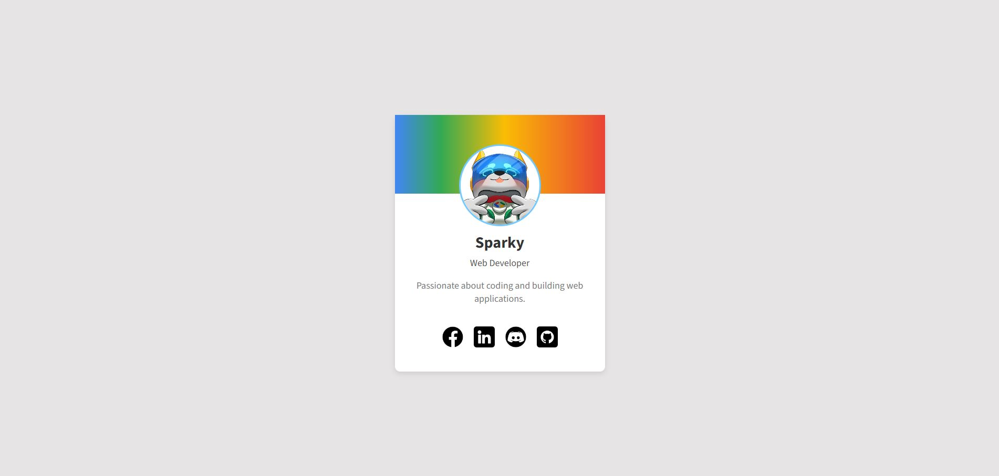

# 🚀 CSS3 Assignment - Profile Card 🎨

Objective:
Learn to style a professional and personalized profile card using CSS box model properties. You will complete the styles in the provided CSS file and personalize the profile content in the HTML file.

## Your Final Output Should Look Like This! 📸

The final output should be a professional and visually appealing profile card, consisting of:

- A **Cover Photo** at the top of the card.
- A **Profile Picture** in the center, styled in a circular frame.
- Your **Profile Information** including your name, title, and bio.
- **Social Links** to your professional profiles, such as LinkedIn, GitHub, etc.
  

Let's get started! 💪

## Step-by-Step Instructions 🛠️

### Step 1: Familiarize Yourself with the HTML Structure 📄

- Open the `index.html` file in your text editor.
- Examine the key sections of the profile card:
  - **Cover Photo**: Located in `
`.
  - **Profile Picture**: Found inside `
`.
  - **Profile Information**: Includes your name, title, and bio within `
`.
  - **Social Links**: Found in the `
` section, where icons are listed as `<li>` elements.

### Step 2: Customize the Content in the HTML File ✏️

- **Change the Name 🧑‍💻**  
  Locate the `<h2>` tag inside `
` and replace the default name with your own.
- **Edit the Title 🏷️**  
  Find the `
` tag and replace the text with your desired professional title (e.g., "Software Developer" or "Web Designer").
- **Write a Bio 📝**  
  Update the `
` tag with a one-sentence summary about yourself or your aspirations.
- **Update Social Links 🌐**  
  Replace the `href` attribute in each `<a>` tag inside the `
` with links to your own profiles (e.g., GitHub, LinkedIn, etc.).  
  If you don’t have accounts on certain platforms, either remove the corresponding `<a>` tag or leave the link as `#` for now.
- **Change the Profile Image 📷**  
  Locate the `` tag inside `
` and replace the `src` attribute with the link to your own profile picture image file. Ensure that the image fits well into the circular profile picture container.

### Step 3: Style the Body 🖥️

- **Font Family**: Choose a clean and readable font for the body text. You can use a Google Font like 'Source Sans 3'.
- **Background Color**: Set your background color to #d7d4d49c.
- **Flexbox**: Use Flexbox to center the profile card in the middle of the page. This will require using:
  - `display: flex`
  - `justify-content: center`
  - `align-items: center`
- **Height**: Set the height to fill the entire screen (100vh).

### Step 4: Style the `.profile-card` 💳

- **Width**: Set the width of your profile card to make sure it’s not too wide or narrow.
- **Background Color**: Set it to #ffffff.
- **Border Radius**: Make it 10px. This will round the edges of your card.
- **Box Shadow**: Add a subtle shadow effect around the card to make it stand out from the background (e.g., 0 4px 10px rgba(0, 0, 0, 0.1)).
- **Text Alignment**: Center the text in the profile card.

### Step 5: Style the `.cover-photo img` 🖼️

- **Width**: Make the image take up the entire width of the cover photo container (100%).
- **Height**: Choose a height for the cover photo (e.g., 150px).
- **Object Fit**: Set this to `cover` to ensure the image covers the entire area without distorting.

### Step 6: Style the `.profile-content` 📜

- **Padding**: Add padding on the left and right side to give the profile content some space from the edges.
- **Position**: Set this to relative so you can adjust the position of other elements relative to it.
- **Margin Top**: This will adjust the position of the profile picture (e.g., negative margin to bring it up and overlay).

### Step 7: Style the `.profile-picture` 🖼️

- **Width & Height**: Set the profile picture’s dimensions (150px by 150px).
- **Border**: Add a border around the profile picture to make it stand out. (3px solid #71c9ff)
- **Border Radius**: Use `50%` to make the profile picture a perfect circle.
- **Margin**: Use auto for left and right margin to center the profile picture. (0 auto)
- **Overflow**: Use hidden to crop any part of the image that overflows.
- **Background Color**: Set this to #ffffff.
- **Position**: Use relative and set a higher z-index to bring the picture above other elements.
- **z-index**: Set it to 2 to bring the picture above other elements.

### Step 8: Style the `.profile-picture img` 📷

- **Width & Height**: Make the image fill the entire area of the profile picture container (100%).
- **Object Fit**: Set this to `cover` to ensure the image covers the entire space without stretching.

### Step 9: Style the `.profile-info` 📝

#### Style the `.profile-info h2` (Name) 💼

- **Font Size**: Set the font size to `30px`.
- **Font Weight**: Set to `bold` for emphasis.
- **Margin**: Use `10px 0 5px` for top and bottom margins.
- **Color**: Set the text color to `#333333` for a strong, readable contrast.

#### Style the `.profile-info .title` (Professional Title) 🏷️

- **Font Size**: Set the font size to `18px` for a balanced, readable size.
- **Color**: Use `#555555` for a slightly muted color compared to the name.
- **Margin**: Set `5px 0` for consistent spacing around the title.

#### Style the `.profile-info .bio` (Biography) ✍️

- **Font Size**: Set the font size to `18px` to match the title for consistency.
- **Color**: Use `#777777` for a lighter, less prominent color.
- **Margin Top**: Set `18px` for a bit of space above the bio to separate it from the title.

### Step 10: Style the `.social` 🕹️

- **Margin**: Add some margin at the top and bottom of the social section to give it some space.

### Step 11: Style the `.social ul` 📱

- **Display Flex**: Use Flexbox to arrange the social links in a row.
- **Justify Content**: Set it to center.
- **Padding & Margin**: Set both to 0 to remove any unwanted space.
- **List Style**: Set it to none to remove bullet points.
- **Gap**: Set space between the icons for a clean layout.

### Step 12: Style the `.social li` 🔵

- **Display**: Set this to inline-block to make the icons appear next to each other.

### Step 13: Style the `.social a` 🔗

- **Display**: Set to inline-block to allow the link to act like a button.
- **Width & Height**: Set both to 40px to define the size of the social icons.
- **Border Radius**: Use `50%` to make the social icons round.
- **Overflow**: Set this to hidden to crop any parts of the image that extend beyond the border.

### Step 14: Style the `.social img` 📷

- **Width & Height**: Set both to 100% to make the images fit perfectly inside the circle.

## Happy Coding🎉

### "Remember, coding is like building a puzzle—take it step by step, and don’t be afraid to experiment. Have fun, stay creative, and show the world your awesome skills. 🚀 Good luck! - Sparky"
