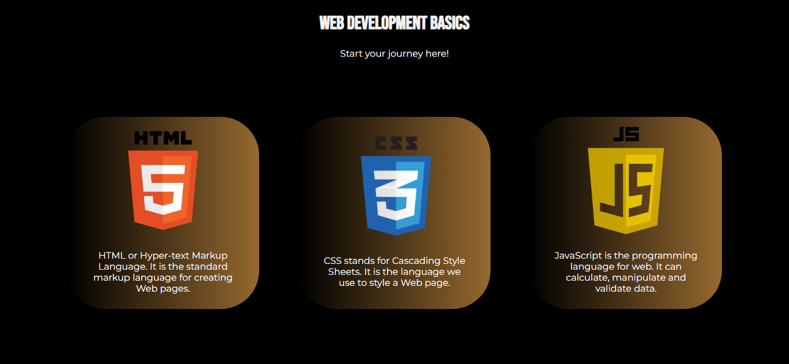

# CSS 4 - Flexbox Layout (Centering Elements) ⬜⬜⬜

Goal: 
Create a selection with three centered divs using flexbox properties that has a responsive layout and hover effects

## 💻 Final Output 💻

The final output should be a:

- **Webpage** with a black background
- **Title** heading and subtitle at the top  
- **Three** centered divs with **web development and programming languages**
- Clickable divs with **links**.
- **Logo** and **Details** of web development languages
- Seamless glowing effects when **hovered**

## So what are we waiting for? Let's start! 🧑🏾‍💻

## Here are the steps 👣

## Step 1: ⬜ Check the HTML codes and analyze its structure ⬜

- `h1` which is the heading **title** and the p tag with the id of `#subtitle`
- A **container** div with the class `flexboxContainer` which has three divs inside
- The divs with IDs of **box**, **box2**, and **box3**
- The divs inside has elements including:
    - `<a>` tags that wraps other div elements
    - `` tags that contains the logo of the programming languages
    - `
` tag that contains the description of each one

## Step 2: ⬜ Stylize the titles and body ⬜

- First, we need to set the background color of the `body` to black
    - `background-color: #000000;`

- Now, style the `h1` text and center it. Bebas neue font is used for the title
    - `text-align: center;`
    - `font-family: "Bebas Neue", sans-serif;`
    - `color: #f1f1f1;`

- Same with the `h1`, stylize `#subtitle` with the font family of Montserrat;
    - `font-family: "Montserrat", sans-serif;`

## Step 3: ⬜ Stylize the div container `.flexboxContainer` ⬜

- Let us set it's size.
    - `width: 100%`
    - `heigth: 500px;`

- Now, we implement the flexbox properties
    - `display: flex;` 
    - `flex-direction: row;` 
    - `align-items: center;`
    - `justify-content: center;`
    - `gap: 5%;`

## Step 4: ⬜ Stylize the divs inside the container ⬜

- At this point, we need to style the divs inside the container. This can be done efficiently by selecting all the child elements of the container 
    - `.flexboxContainer > div`

- Set the `width` to 20% and `height` to 50%
- Set the background to a linear-gradient for the **fade** effect
    - `background-image: linear-gradient(to right, rgba(12, 62, 224, 0), rgb(150, 105, 47));`

- Center the elements using flexbox properties
- Set the `flex-direction` to `column`
    - `flex-direction: column;`

- Add a `gap` and `padding` to ensure that the text will not overlap outside the box
    - `gap: 5%;`
    - `padding: 3%;`

- For visual aesthetics, add a `transition-duration` property and `cursor: pointer;`

## Step 5: ⬜ Styling the `<a>` and `` tag ⬜

- Styling the `<a>` tag is important since it changes the format of texts it covers.
- Set the `text-decoration` to none
    - `text-decoration: none;`
- Justify, center, and set its `font-family` to Montserrat.
- For the ``, set its width to 80%

## Step 6: ⬜ Apply hover effect ⬜

- Select all the children divs of the `flexboxContainer`
    - `.flexboxContainer > div:hover`
- Set `background-color` and `box-shadow`to create the effect shown in the output. 

## Open your `.html` file and you should have centered divs!

## HAPPY CODING!!! 💻🖱️🥳