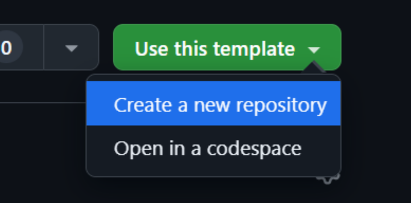
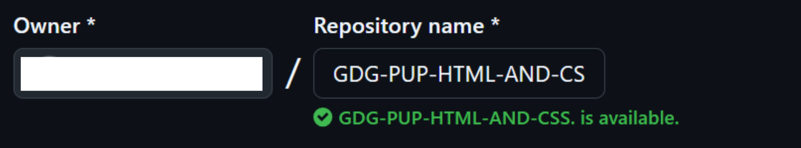
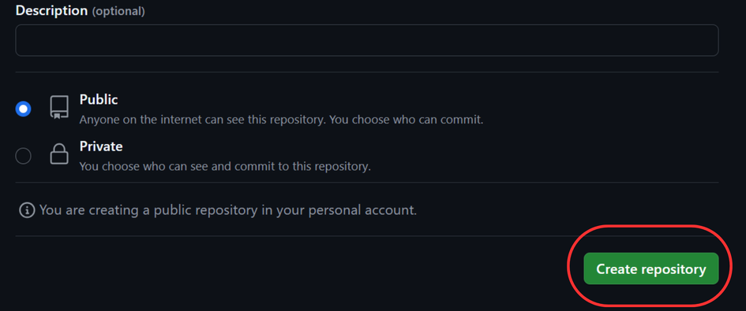
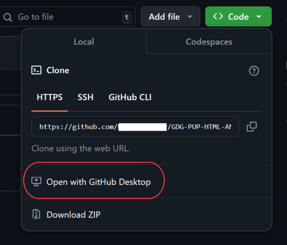
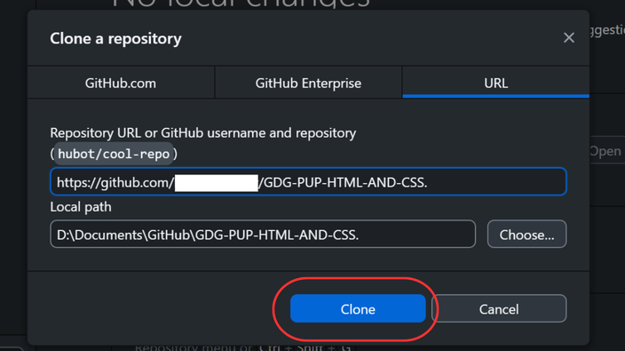

# 🧑🏻‍💻 HTML & CSS 🚀

Welcome to **HTML & CSS Workshop!** Join us on this journey through HTML and CSS fundamentals at GDG PUP Web Development.

Dive deeper into the world of web design with hands-on practice! 🌐 This repository is designed for cadets to solidify their skills and reinforce key concepts from the HTML & CSS workshop held during November 24 live study jam. Whether you're refreshing what you learned or taking your first steps in web development. Let’s turn your ideas into beautiful web pages!

### 👀 What's Inside It

This repository contains the following **main** folders:

1. **Assignments folder**: Consists of exercises designed to reinforce your understanding of HTML and CSS.
2. **Project folder**: Contains a single main project that you will complete as part of this study jam.

## 📅 Assigments

###  HTML Assignments

| No. | Topic                                | Description |
| --- | ------------------------------------ | ----------- |
| 1   | Basic Structure (My First Webpage)   | Create a simple HTML page with basic structure: `<!DOCTYPE html>`, `<html>`, `<head>`, and `<body>`. Add a title in `<head>` and a main heading in `<body>` that says "Welcome to My Page." |
| 2   | Text and Headings (About My Hobby)   | Add a few paragraphs describing your favorite hobby. Use different heading levels (`<h1>` to `<h3>`) for sections like "Introduction," "Why I Love It," and "Conclusion." |
| 3   | Links and Images (Clickable Image Link) | Insert an image related to your hobby and make it clickable, linking to an external website with more information about it. |
| 4   | Lists (Favorites List)               | Create an unordered list of "Top 3 Things I Need for My Hobby" and an ordered list of "Steps to Get Started." |

###  CSS Assignments

| No. | Topic                                | Description |
| --- | ------------------------------------ | ----------- |
| 1   | Text Styling (Facebook Logo Text)    | Apply CSS to style your headings and paragraphs. Use different font sizes, colors, and add bold or italic styles. Try to recreate the "Facebook" logo text style. |
| 2   | Button Styling (YouTube Subscribe Button) | Style the form's submit button to resemble the YouTube "Subscribe" button. Change its background color to red, text color to white, add padding, and rounded corners. |
| 3   | Box Model (Profile Card)             | Create a container `
` around your form or a profile card. Use CSS to add padding, margin, and a border. Experiment with different values to see the effect. |
| 4   | Flexbox Layout (Centering Elements) | Use Flexbox to create a Simple Google(.)com clone align divs Horizontally and Vertically. |

## Your First Project Assignment!

### Project Description
In this project, you'll create a Static Blog Website inspired by a professional developer hub. Your blog will feature multiple sections, including:

- Header: Display the blog name and navigation links (Home, Articles, Resources, Contact).
- Hero Section: Add a banner with a welcome message for readers, such as "Your journey to mastering web development starts here."
- Blog Posts: Display sample blog posts with titles, publication dates, and short descriptions. Use images for each post, and style them similarly to a professional blog layout.
- Sidebar (Top Picks): Add a sidebar with a "Top Picks" section, showcasing links to popular articles with thumbnails.
- Footer: Include links to Privacy Policy, Terms of Service, and Support information, along with copyright information.
  
### Skills Practiced
- HTML: Structuring content, using semantic elements, creating lists, links, and forms.
- CSS: Styling text, positioning elements, using Flexbox for layout, and adding responsive design features.
This project will help you build a solid foundation in creating static, content-driven websites. Let your creativity flow as you experiment with different layouts and styles!

---
## 🌟 Getting Started with GDG-PUP Repository Template
Follow these steps to set up your own repository using the GDG-PUP template, complete with an existing directory structure and files to participate in HTML & CSS workshop.

1. Access the Template:
- Go to the main page of the GDG-PUP repository on GitHub.
- Click on the **Use this template** button.

2. Name and Visibility:

- Name the new repository following the format GDG-PUP-HTML-AND-CSS 
- Ensure it is set to public.

2. Create the Repository:

- Click Create repository on the lower right to generate it in your GitHub account.

NOTE: Name it in the GDG-PUP-HTML-AND-CSS format to ensure consistency.

3. Clone the Repository:

- Go to the repository’s main page, click on the Code button, and choose Open with GitHub Desktop to launch it in GitHub Desktop.

4. Complete the Clone:

In GitHub Desktop, click Clone to download the repository to your local machine.

---
## Submission
- For submission, an assignment in Google Classroom will be provided where you can upload the necessary requirements for this workshop. Please check Google Classroom for further details and deadlines for each assignment.

## 🎉 Happy Coding! 
We’re excited to see your creativity and dedication shine through this project. Let’s make this an amazing learning experience together. Remember, every line of code you write brings you one step closer to mastering wev development. Good luck, and enjoy the journey! 🚀💻

